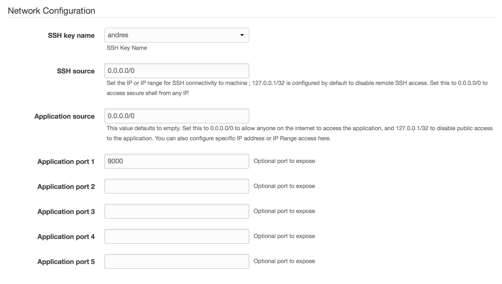

# Base image template

In this example, you can find how to install a new service on top of the base image for Stacksmith. [Minio](https://www.minio.io) is a high performance distributed object storage server, designed for large-scale private cloud infrastructure. It is compatible with the Amazon S3 API.

## Package and deploy with Stacksmith

1. Go to [stacksmith.bitnami.com](https://stacksmith.bitnami.com)
2. Create a new application and select the `Base image` Stack Template
3. Select the targets you are interested on (AWS,K ubernetes,...)
5. Upload the [_build.sh_](scripts/build.sh) and [_run.sh_](scripts/run.sh) scripts from the [_scripts/_](scripts/) folder. For this example it is not necessary to upload any application file since the Minio binary will be downloaded at build time.
6. Click the `Create` button

## Scripts

In the scripts folder, you can find the required scripts to run this service. 

### build.sh 

That file takes care of performing all the steps to install this new service in the machine.

- Downloads the Minio Linux binary
- Creates the system user to run this server
- Creates the storage folder that Minio will use

### run.sh 

This file is ran to start the Minio server.

## Running the application in AWS

Once the AWS build is ready click on _Launch in AWS_. This will take to the AWS wizard for fulfilling the application details. In the first view _Select Template_ just click on _Next_.

In the next page you will need to fulfill some values:



You will need to give the Stack a name and then in the _Network Configuration_ section we need to set the SSH key name to ours key pair, set the SSH and the Application source to `0.0.0.0/0` so it allows connections from anywhere and set the application port to 9000.

Then create the stack, after a few minutes you should be able to see your machine running:


And you should be able to see the IP of your machine:


You should be able to ssh to your machine and obtain the user and password required to login retrieving the Stacksmith run logs:

```
$ ssh centos@34.239.155.57
$ systemctl status stacksmith-run
● stacksmith-run.service - Stacksmith run script
   Loaded: loaded (/etc/systemd/system/stacksmith-run.service; enabled; vendor preset: disabled)
   Active: active (running) since Wed 2018-02-07 12:36:23 UTC; 4min 33s ago
 Main PID: 1806 (run.sh)
   CGroup: /system.slice/stacksmith-run.service
           ├─1806 /bin/bash /opt/stacksmith/stacksmith-scripts/run.sh
           └─1831 /opt/stacksmith/user-uploads/minio server /data

Feb 07 12:36:25 ip-10-0-9-254.ec2.internal run.sh[1806]: Browser Access:
Feb 07 12:36:25 ip-10-0-9-254.ec2.internal run.sh[1806]: http://10.0.9.254:9000  http://127.0.0.1:9000
Feb 07 12:36:25 ip-10-0-9-254.ec2.internal run.sh[1806]: Command-line Access: https://docs.minio.io/docs/minio-client-quickstart-guide
Feb 07 12:36:25 ip-10-0-9-254.ec2.internal run.sh[1806]: $ mc config host add myminio http://10.0.9.254:9000 3DW67WARTFMT0HI0189N piSAf/LFCoRiKRp3M5a3xrgbsTKCVKOfeVGKnMf3
```

Now you can login into the application using the IP of your machine, the port 9000 and the credentials shown in that log (in the `mc config` command, using the last argument as Secret Key and the previous one as Access Key):


## Running the application in Kubernetes

This guide asumes that you have a running cluster with Tiller running and that you have [authorized it to access to the images in ECR](https://beta.stacksmith.bitnami.com/support/faq-k8s#How-do-I-authorize-my-Kubernetes-cluster-to-connect-to-my-Amazon-EC2-Container-Registry). Once that is done, download the Helm chart produced by Stacksmith and extract its content:

```
$ tar zxvf minio-1.0-docker-113863589.tar.gz
x minio/Chart.yaml
x minio/values.yaml
x minio/templates/NOTES.txt
x minio/templates/_helpers.tpl
x minio/templates/deployment.yaml
x minio/templates/service.yaml
x minio/README.md
```

We need to perform a small modification. We will change the service `type` and `internalPort` so we can directly access Minio after installing the chart:

`minio/values.yaml`:
```patch
service:
  name: app
- type: ClusterIP
+ type: NodePort
  externalPort: 80
- internalPort: 8080
+ internalPort: 9000
```

If you are following this guide with Minikube `NodePort` will expose a port that will be reachable using the Minikube IP. In case you are deploying the chart with a Cloud Provider you can set the `type` to `LoadBalancer` and it will provide you with a public IP to access the application.

Apart from that, Stacksmith doesn't provide yet a default volume to be used to persist application's data. To do so we need to modify the default template for our deployment:

`minio/templates/deployment.yaml`:
```patch
spec:
  replicas: {{ .Values.replicaCount }}
  template:
    metadata:
      labels:
        app: {{ template "fullname" . }}
    spec:
+     volumes:
+     - name: data
+       emptyDir: {}
      containers:
      - name: {{ .Chart.Name }}
        image: "{{ .Values.image.name }}"
        imagePullPolicy: {{ .Values.image.pullPolicy }}
        ports:
        - containerPort: {{ .Values.service.internalPort }}
+       volumeMounts:
+         - name: data
+           mountPath: /data
        resources:
{{ toYaml .Values.resources | indent 12 }}
```

Now everything is ready. Lets install the chart:

```
$ helm install ./minio
NAME:   eponymous-warthog
...
```

Whenever the pod is running you should be able to retrieve the credentials:

```
$ kubectl get pods
NAME                                       READY     STATUS    RESTARTS   AGE
eponymous-warthog-minio-7bbb4696f8-j2dkk   1/1       Running   0          5m
$ kubectl logs eponymous-warthog-minio-7bbb4696f8-j2dkk
No "entrypoint.sh" script provided, skipping...
Created minio configuration file successfully at /root/.minio

Drive Capacity: 9.2 GiB Free, 15 GiB Total

Endpoint:  http://172.17.0.21:9000  http://127.0.0.1:9000
AccessKey: T7BF8I00JLDQP3KVXHGM
SecretKey: 4+e5vvD2KwpFIbbzccyyYvlgYZ9uanAJXoay96W1
```

You should be able to login using those credentials. You can retrieve the login URL executing the NOTES printed after installing the Chart:

```
export NODE_PORT=$(kubectl get --namespace default -o jsonpath="{.spec.ports[0].nodePort}" services eponymous-warthog-minio)
export NODE_IP=$(kubectl get nodes --namespace default -o jsonpath="{.items[0].status.addresses[0].address}")
echo http://$NODE_IP:$NODE_PORT/login
```