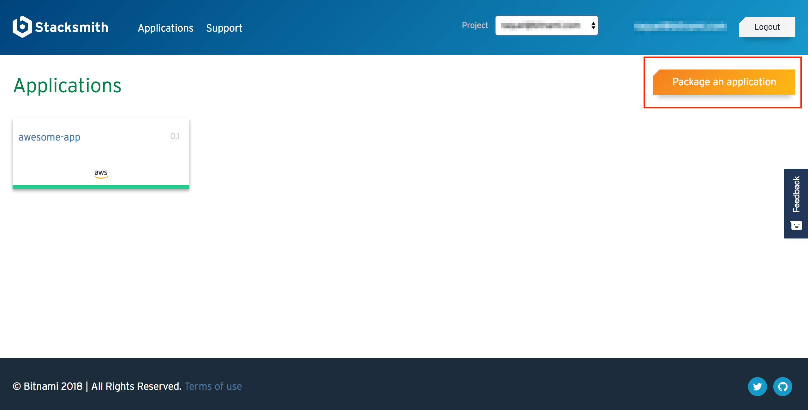
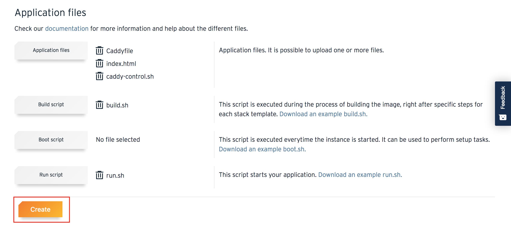
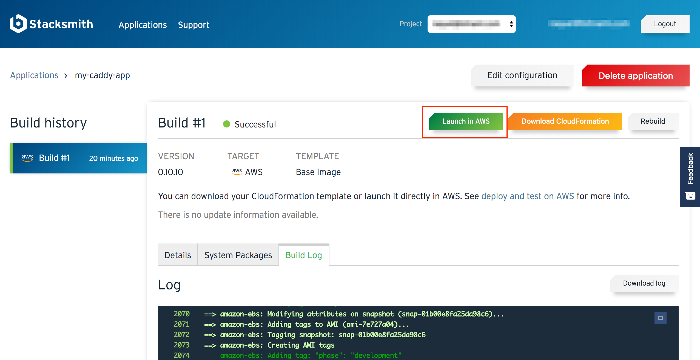
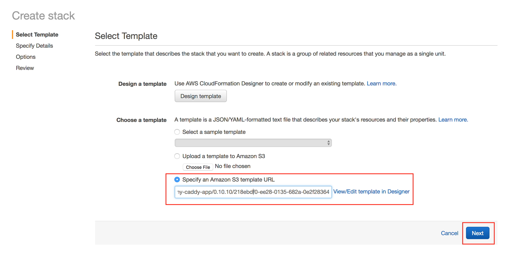
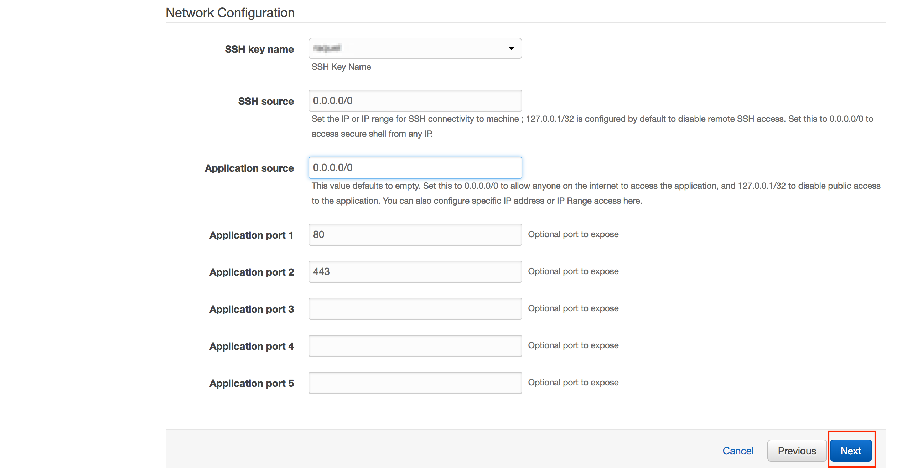
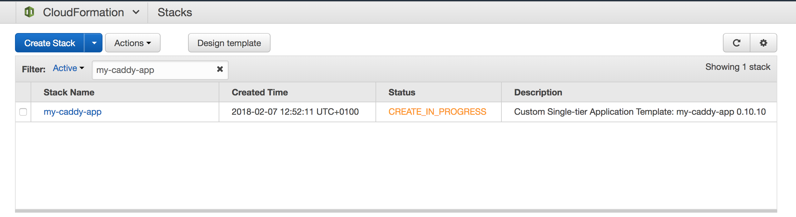

Since the [digital transformation](https://www.gartner.com/smarterwithgartner/embrace-the-urgency-of-digital-transformation/) is a must for every business, **the need of embracing digital technologies** that allow companies to automate their processes has increased exponentially. 
Organizations -especially IT organizations- work every day with digital technologies that help them to be more productive, reliable, and secure since the human error dicrease thaks to automation. But the most common scenario is having all these in-house applications and services hosted and run in an on-premises data center.

**Supporting in-house all those legacy applications is costly, inefficient, and time-consuming since they require to manually schedule application and OS updates, as well as security patches.**
For that reason, many companies are moving to managed solutions, and of course, the most popular choice is [to migrate your IT resources to the cloud](http://blog.bitnami.com/2018/01/top-5-excuses-for-not-migrating.html). Problems arise when they realize that although they are not a Fortune-500 size company, they are needing a Fortune-500-level IT service. What can they do in that case? 

## Replatform legacy applications to embrace the cloud

Adapt your legacy software to the cloud is not as easy as it sounds. It implies that you need to address the best practices and requirements of the major cloud/container providers so you need to have a high-level knowledge in coding and a strong DevOps team. If you are searching for cost-effectiveness, automation, and reliability, chances are that you finally choose to [replatform your legacy applications](http://blog.bitnami.com/2018/01/replatforming-legacy-applications.html) as the best alternative to move them into the cloud.
Now, a lot of questions arises: *How can I adjust my code to the cloud/container target platform? Which are the changes do I need to perform in it?*

**Bitnami Stacksmith** is a tool that follows the one-click Bitnami philosophy created to replatform your applications in an automate, easy, and reliable way. So it can answer all these questions for you. Stacksmith packages your code following the requirements and best practices of the platform you choose. It helps you to **deploy and run the application either on the cloud or on Kubernetes**, and also automates its software updates. Incredible, right? 
The only thing you have to do is uploading your application code, the related scripts, and choosing the platform target. Yes, that’s all. 

> Bitnami Stacksmith simplifies the migration of your applications to the cloud by automating the manual tasks required to package, deploy and maintain software stacks for all major container and cloud platforms. 

*Michael Murphy, Product Marketing at Bitnami*.

In this post you will learn how to quickly deploy a PHP application called [Caddy](https://caddyserver.com/features) on AWS by previously packaging its code and transforming it into a Cloud Formation template using Stacksmith. For further information about how Bitnami Stacksmith works, check the [Bitnami Stacksmith Quick Start guide for AWS](https://beta.stacksmith.bitnami.com/support/quickstart-aws).

## Let’s try Bitnami Stacksmith

Caddy is a general-purpose HTTP/2 web server that serves HTTPS by default. It is very easy to configure it thanks to the Caddyfile, includes Automatic HTTPS on (via Let's Encrypt) and HHTP/2  by default, and can be extended with plugins.

To demonstrate how easy it is to package an application and deploy it on AWS with Stacksmith, I will use an example application and script files you can find in the following [Bitnami GitHub repository](https://github.com/bitnami/stacksmith-examples/tree/master/base-image/caddy). I strongly recommend you to clone the project to perform the tasks below with ease. 

These are the steps you will follow:

* Package the existing application in Bitnami Stacksmith
* Launch the resulting Cloud Formation Template on AWS
* Access the running application 

### Packaging the existing application in Bitnami Stacksmith

* Log in to the Stacksmith (if you are not logged yet).

  

* Select your project in the top menu of the Applications dashboard.

  

* Once you are in your project dashboard, click “Package an application”.

  

* In the “Create a new application” screen I will provide the following information:
  * Application name: don’t use spaces in the application name.
  * Application version
  * Stack template: in this case, I selected “Base image”.
  * Operating System: Stacksmith uses CentOS by default.
  * Target: I have selected AWS.

  

* Scrolling down, you will see the “Application files” section. As you can see in the image below, Caddy is composed of three application files, one build script, and one run script. Once these files are uploaded to Stacksmith, start the build by clicking “Create”.

* This, opens the “Build history” in which you can check the status of the application building. It can take several minutes, depending on the application. 

* Once the build has finished, its status will change from “Building” to “Successful”. now, it is time to launch your application on AWS.

### Launching the resulting Cloud Formation Template on AWS

Once the build is successful, the “Launch in AWS” button appears in the upper right side of the screen. 

* Click on the “Launch in AWS” button to start the launch of the instance. 

  

  You will be redirected to the AWS Cloud Console “Create Stack -> Select Template” section. As you can see in the image below, the Amazon S3 template URL is already preselected and it is the one resulting from the build process done in Stacksmith. Click “Next” to proceed.
  
  

* Provide resources to your instance in the next screen if apply. If don’t, skip this step by clicking “Next”.
* Specify some values for the instance such as the SSH key or ports. Set both the SSH and application source to 0.0.0.0/0. Click “Next” to continue. 

  

* In the resulting screen, check that all the values are correct and click “Create” to launch your stack on an instance. 

  

  You will be redirected to the “Cloud Formation -> Stacks” list in which you can see the status of your stack creation.

  

  The status “CREATE_COMPLETE” means that your stack has been launched and your application is up an running.

### Accessing the running application 

* In the “Cloud Formation -> Stacks” list, click on the name of your stack to see the “Stack Detail” page. 
* Click the “Outputs” section and note down the server public IP address of your application.

  

* Enter the public IP address in a browser. Congratulations, the Caddy application has been successfully deployed!

  
