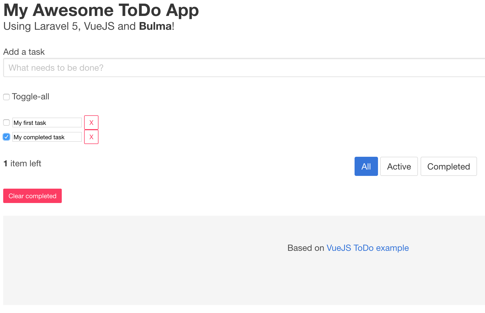

# Introduction
Simple application for managing your ToDo list. 



This application is split into:

* Frontend using [Vue](http://vuejs.org)
* Backend using [Laravel](http://laravel.com/docs)

# Package and deploy with Stacksmith

1. Go to [stacksmith.bitnami.com](https://stacksmith.bitnami.com)
2. Create a new application and select the `Generic application with DB (MySQL)` template
3. Select the targets you are interested on (AWS, Kubernetes,...)
4. Compress the _todo/_ folder from this repo and upload it as application files:

   ```bash
   $ git clone https://github.com/bitnami/stacksmith-examples
   $ cd stacksmith-examples/php
   $ tar czf todo.tar.gz todo
   ```

5. Upload the [_build.sh_](scripts/build.sh) and [_run.sh_](scripts/run.sh) scripts from the [_scripts/_](scripts/) folder.
6. Click the <kbd>Create</kbd> button

## Scripts

Required scripts to build and run this application:

### build.sh

This script is executed during the process of building the image, right after specific steps for each stack template. The script performs the next following actions:

* Install wget
* Download and install Bitnami LAMP
* Install de Todo Application from the tarball

### run.sh

This script just starts the application.

# Items to be fixed
1. Add an user and grant him permissions for running Apache and listen to 80
2. Check permissions for storage/logs/laravel.log
3. Check permissions for storage/framework/views